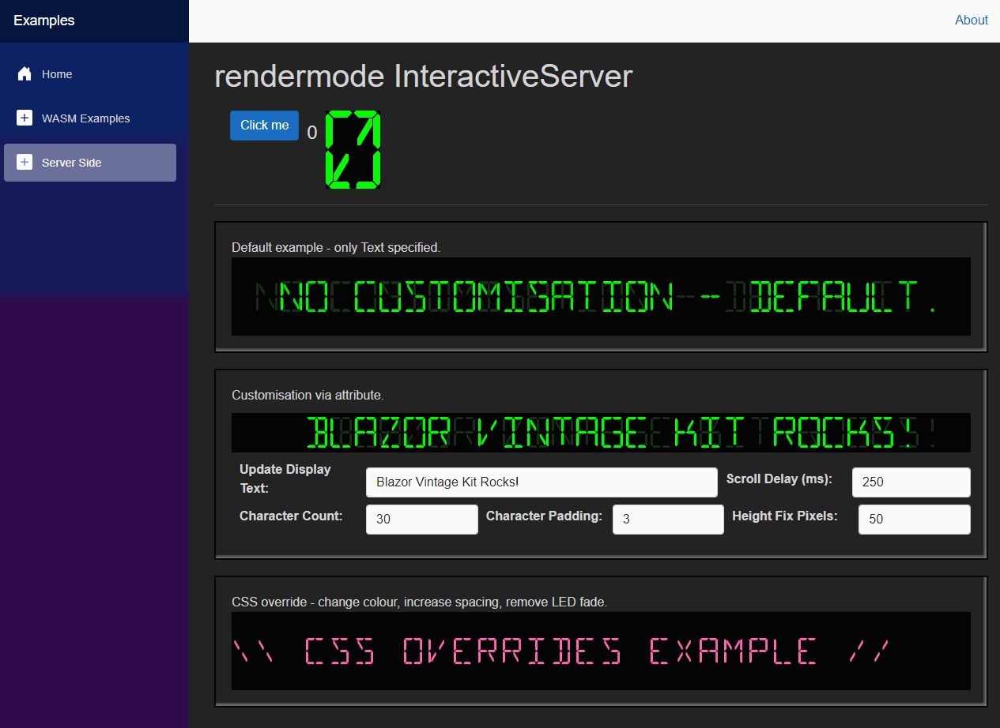
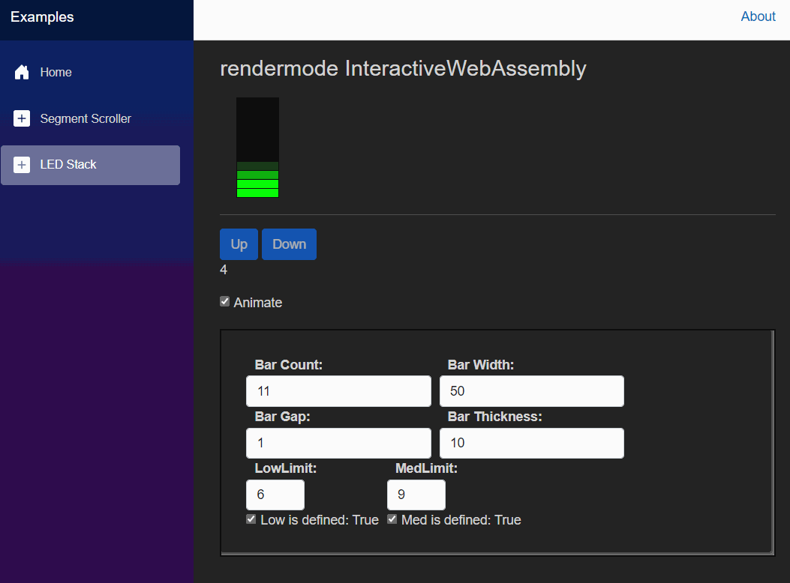
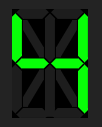
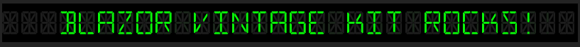
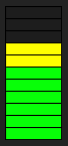

# BlazorVintageKit

A vintage inspired seventeen segment display and configuration scoller for Blazor. Supports serverside or wasm interaction.

<a href="https://blazorvintagekit-gjefahhff5dng7dg.uksouth-01.azurewebsites.net/">Demo site here</a> (azure free tier, might be slow or stopped if quota is exceeded).

  
Click for seventeen segment animated screenshot

  
  

  
Click for LED stack animated screenshot

  
  

## Table of Contents

1. [Installation](#installation)
2. [Usage](#usage)
3. [Contributing](#contributing)
4. [License](#license)
5. [Contact](#contact)

## Installation

<code>dotnet add package BlazorVintageKit</code>

After installation include css from the package:
<code> &lt;link rel="stylesheet" href="_content/BlazorVintageKit/BlazorVintageKit.css" /> </code>

## Usage
[See the examples in this repo.](https://github.com/BrettLaw/BlazorVintageKit/tree/dev/src/Examples/Examples.Client/Pages)

This package provides:

* A seventeen segment display: 
	 
	<code><BlazorVintageKit.Components.SeventeenSegmentDisplay Character="@CurrentCharacter" /></code>
* A scroller composed of seventeed segment displays:
	 
	<code><BlazorVintageKit.Components.RetroScrollingDisplay DisplayText="Text to scroll." /></code> 
	customisable like this: 
	<code><BlazorVintageKit.Components.RetroScrollingDisplay DisplayText="@DisplayText" ScrollDelayMS=@ScrollDelay CharacterCount=@CharacterCount LoopPadding="@LoopPadding" FixHeightPX="@FixHeightPX" /></code>
* An LED stack: 
	 
	<code><BlazorVintageKit.Components.LEDStack BarValue=@barValue BarCount=11 LowLimit=4 MedLimit=7 /></code>
## Contributing
?

## License
MIT - see license.txt

